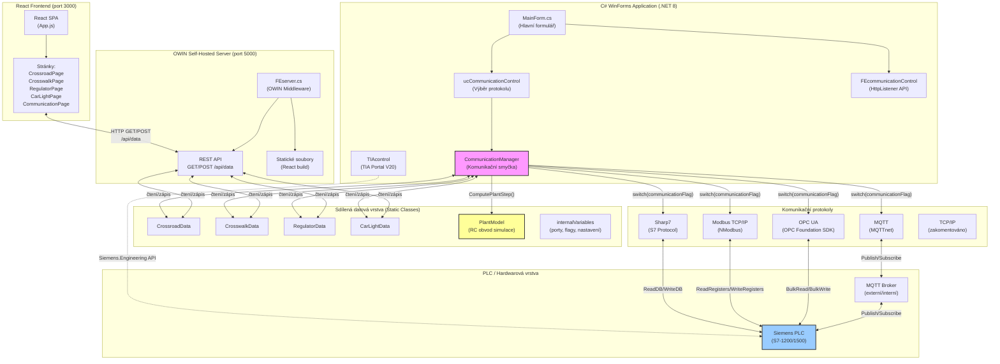

# Architektura řešení – Blokový diagram

Celkový přehled architektury aplikace JAN0837_DP: propojení React frontendu, C# WinForms backendu, komunikačních protokolů a PLC.

## Popis vrstev

| Vrstva | Technologie | Popis |
|--------|-------------|-------|
| **Frontend** | React.js, Bootstrap | SPA s React Router, stránky pro každý model |
| **API Server** | OWIN Self-Hosted (port 5000) | Servíruje React build + REST API endpointy |
| **WinForms GUI** | .NET 8 WinForms | Hlavní formulář s ovládacími prvky komunikace |
| **Sdílená data** | Statické C# třídy | Mezivrstevní sdílení dat bez kopírování |
| **Komunikace** | MQTT, OPC UA, Modbus, Sharp7 | Výběr protokolu přes `internalVariables.communicationFlag` |
| **PLC** | Siemens S7-1200/1500 | Průmyslový řadič s logikou křižovatky/regulátoru |
