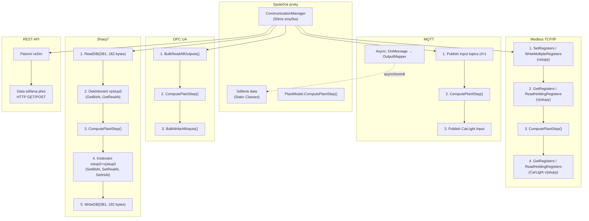

# Porovnání komunikačních protokolů

Souhrnné porovnání všech implementovaných komunikačních protokolů v aplikaci JAN0837_DP.

## Srovnávací tabulka

| Vlastnost | MQTT | OPC UA | Modbus TCP/IP | Sharp7 | REST API |
|-----------|------|--------|---------------|--------|----------|
| **Knihovna** | MQTTnet | OPC Foundation SDK | NModbus | Sharp7 | OWIN Self-Hosted |
| **Master režim** | Publish (client) | ❌ Neimplementováno | Server (drží registry) | N/A (jen client) | Pasivní (jen status) |
| **Slave režim** | Publish (client) | BulkRead/BulkWrite | Client (čte/píše registry) | ReadDB/WriteDB | Pasivní (jen status) |
| **Přenos vstupů** | Publish JSON na topic | BulkWriteAllInputs() | WriteMultipleRegisters | SetBitAt/SetRealAt → WriteDB | HTTP POST /api/data |
| **Přenos výstupů** | OnMessage callback (async) | BulkReadAllOutputs() | ReadHoldingRegisters | ReadDB → GetBitAt/GetRealAt | HTTP GET /api/data |
| **Datový formát** | JSON | OPC UA Binary | Modbus registry (ushort[]) | Byte array (182B) | JSON |
| **Float kódování** | Nativní JSON | OPC UA Float | 2 registry (ModbusHelper) | S7 REAL (4B Big-Endian) | Nativní JSON |
| **Bool kódování** | JSON true/false | OPC UA Boolean | 1 registr (ushort 0/1) | 1 bit (byte.bit) | JSON string "true"/"false" |
| **Počet volání/cyklus** | 4× Publish | 2× (BulkRead + BulkWrite) | ~8× (4 write + 4 read) | 2× (ReadDB + WriteDB) | Polling (na vyžádání) |
| **PlantModel pozice** | Po publish vstupů | Mezi BulkRead a BulkWrite | Mezi Write a Read výstupů | Mezi ReadDB a WriteDB | N/A |
| **Reconnect delay** | 200ms | 1000ms | 500ms | 500ms | N/A |
| **Error delay** | 500ms | 500ms | 500ms | 500ms | N/A |
| **Smyčka delay** | 50ms | 50ms | 50ms | 50ms | N/A |
| **Topics/Registry** | 4 Input + 4 Output topics | Node IDs v datových třídách | Registry 1-77 | DB1 byte offsets | /api/data |
| **QoS** | AtLeastOnce (1) | Subscription-based | N/A | N/A | HTTP 200 |
| **Retain** | true | N/A | N/A | N/A | N/A |

## Diagram srovnání toků dat

## Klíčové rozdíly

### 1. Směr přenosu výstupů
- **MQTT**: Výstupy přicházejí **asynchronně** přes `OnMessage` callback (mimo hlavní smyčku)
- **OPC UA, Modbus, Sharp7**: Výstupy se čtou **synchronně** v každé iteraci smyčky
- **REST API**: Výstupy se čtou **na vyžádání** přes HTTP GET

### 2. Granularita přenosu
- **MQTT**: 4 oddělené JSON zprávy (po tématech)
- **OPC UA**: 2 bulk operace (nejefektivnější)
- **Modbus**: ~8 oddělených read/write operací
- **Sharp7**: 2 operace, ale přenáší celý DB (182B) včetně nepotřebných dat

### 3. Pozice PlantModel.ComputePlantStep()
- **Všechny protokoly**: Mezi čtením výstupů a zápisem vstupů (nebo po publish vstupů u MQTT)
- **Účel**: RC obvod simulace potřebuje aktuální Uin z PLC pro výpočet Uc1/Uc2

### 4. Master vs Slave
- **MQTT**: Master a Slave dělají téměř totéž (oba publish)
- **OPC UA**: Master = Server (neimplementováno), Slave = Client (BulkRead/Write)
- **Modbus**: Master = Server (drží registry), Slave = Client (čte/píše vzdáleně)
- **Sharp7**: Žádný přepínač, vždy klientský režim
- **REST API**: Žádný přepínač, vždy pasivní

### 5. Zakomentované modely
Následující datové modely jsou zakomentované ve **všech** protokolech:
- `CarWashData` (vstup + výstup)
- `WashingMachineData` (vstup + výstup)
