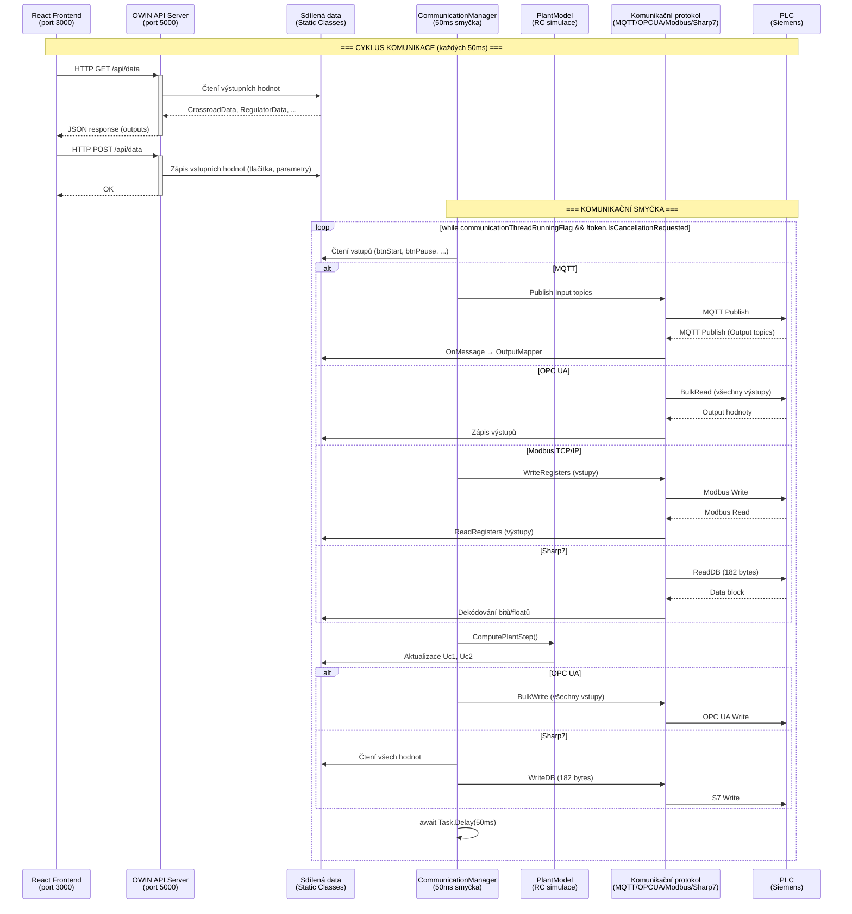

# Tok dat – Sekvenční diagram

Sekvenční diagram zobrazující tok dat mezi všemi vrstvami aplikace.

## Klíčové body

1. **React ↔ API**: Polling přes HTTP GET/POST, data se sdílí přes statické třídy
2. **CommunicationManager**: Běží v samostatném vlákně s 50ms intervalem
3. **PlantModel**: Výpočet RC obvodu probíhá **mezi** čtením výstupů a zápisem vstupů
4. **Asynchronní výstupy (MQTT)**: Výstupy z PLC přicházejí přes `OnMessage` callback, ne v hlavní smyčce
