# Modbus TCP/IP – Sekvenční diagram komunikace

Detailní pohled na Modbus TCP/IP komunikaci – Master (Server) a Slave (Client) režim s mapováním registrů.

```mermaid
sequenceDiagram
    participant CM as CommunicationManager
    participant Server as ModbusTCPIPimServer<br/>(Master = Server)
    participant Client as ModbusTCPIPimClient<br/>(Slave = Client)
    participant Data as Sdílená data
    participant Plant as PlantModel
    participant PLC as Vzdálené zařízení

    Note over CM,PLC: === MODBUS MASTER (Server) REŽIM ===

    alt checkBoxMaster == true
        CM->>Server: Kontrola: slave != null?
        
        alt Server neběží
            CM->>CM: await Task.Delay(500ms)
            CM->>CM: continue
        end

        rect rgb(200, 230, 255)
            Note over CM,Server: ZÁPIS VSTUPŮ DO HOLDING REGISTRŮ
            CM->>Data: Čtení CrossroadData vstupů
            CM->>Server: SetRegisters(1, crossroadInputs[7])
            
            CM->>Data: Čtení CrosswalkData vstupů
            CM->>Server: SetRegisters(8, crosswalkInputs[5])
            
            CM->>Data: Čtení RegulatorData vstupů
            Note over CM: bool(2) + int(1) + 8×float(2 reg each) = 19 registrů
            CM->>Server: SetRegisters(13, regulatorRegisters[19])
            
            CM->>Data: Čtení CarLightData vstupů
            CM->>Server: SetRegisters(32, carlightInputs[4])
        end

        rect rgb(255, 230, 200)
            Note over CM,Server: ČTENÍ VÝSTUPŮ Z HOLDING REGISTRŮ
            CM->>Server: GetRegisters(40, 21)
            Server-->>CM: crossroadOutputs[21]
            CM->>Data: Zápis CrossroadData výstupů
            
            CM->>Server: GetRegisters(61, 11)
            Server-->>CM: crosswalkOutputs[11]
            CM->>Data: Zápis CrosswalkData výstupů
            
            CM->>Server: GetRegistersRaw(72, 2)
            Server-->>CM: regulatorOutputRegs[2]
            Note over CM: Float = 2 registry (ModbusHelper.RegistersToFloat)
            CM->>Data: RegulatorData.Uin = float
        end

        CM->>Plant: PlantModel.ComputePlantStep()

        rect rgb(255, 230, 200)
            CM->>Server: GetRegisters(74, 4)
            Server-->>CM: carlightOutputRegs[4]
            CM->>Data: Zápis CarLightData výstupů
        end
    end

    Note over CM,PLC: === MODBUS SLAVE (Client) REŽIM ===

    alt checkBoxSlave == true
        CM->>Client: Kontrola: IsConnected?
        
        alt Nepřipojen
            CM->>Client: ConnectToSlave()
            alt Připojení selhalo
                CM->>CM: await Task.Delay(500ms)
                CM->>CM: continue
            end
        end

        rect rgb(200, 230, 255)
            Note over Client,PLC: ZÁPIS VSTUPŮ NA SERVER
            CM->>Client: WriteMultipleRegistersAsBool(1, 0, [7])
            Client->>PLC: Modbus FC16 Write Registers (addr 0-6)
            
            CM->>Client: WriteMultipleRegistersAsBool(1, 7, [5])
            Client->>PLC: Modbus FC16 Write Registers (addr 7-11)
            
            CM->>Client: WriteMultipleRegisters(1, 12, [19])
            Client->>PLC: Modbus FC16 Write Registers (addr 12-30)
            
            CM->>Client: WriteMultipleRegistersAsBool(1, 31, [4])
            Client->>PLC: Modbus FC16 Write Registers (addr 31-34)
        end

        rect rgb(255, 230, 200)
            Note over Client,PLC: ČTENÍ VÝSTUPŮ ZE SERVERU
            CM->>Client: ReadHoldingRegistersAsBool(1, 39, 21)
            Client->>PLC: Modbus FC03 Read Registers (addr 39-59)
            PLC-->>Client: crossroadOutputs
            Client-->>CM: bool[21]
            CM->>Data: Zápis CrossroadData výstupů
            
            CM->>Client: ReadHoldingRegistersAsBool(1, 60, 11)
            Client->>PLC: Modbus FC03 Read Registers (addr 60-70)
            PLC-->>Client: crosswalkOutputs
            CM->>Data: Zápis CrosswalkData výstupů
            
            CM->>Client: ReadHoldingRegisters(1, 71, 2)
            Client->>PLC: Modbus FC03 Read Registers (addr 71-72)
            PLC-->>Client: regulatorOutputRegs
            CM->>Data: RegulatorData.Uin (float z 2 registrů)
        end

        CM->>Plant: PlantModel.ComputePlantStep()

        rect rgb(255, 230, 200)
            CM->>Client: ReadHoldingRegistersAsBool(1, 73, 4)
            Client->>PLC: Modbus FC03 Read Registers (addr 73-76)
            PLC-->>Client: carlightOutputs
            CM->>Data: Zápis CarLightData výstupů
        end
    end
```

## Mapování Modbus registrů

### Vstupní registry (zápis aplikace → čtení PLC)

| Registry | Wire Address | Datová třída | Proměnné | Typ |
|----------|-------------|--------------|----------|-----|
| 1–7 | 0–6 | CrossroadData | btnStart, btnPause, btnStop, btnWestCrosswalk1/2, btnSouthCrosswalk1/2 | bool |
| 8–12 | 7–11 | CrosswalkData | btnStart, btnPause, btnStop, btnCrosswalk1/2 | bool |
| 13–14 | 12–13 | RegulatorData | btnReset, switchstate | bool |
| 15 | 14 | RegulatorData | order | int (ushort) |
| 16–31 | 15–30 | RegulatorData | R1, R2, C1, C2, Uc1, Uc2, Td, Ts | float (2 reg each) |
| 32–35 | 31–34 | CarLightData | btnReset, error, sensorLight, sensorConnectorConnected | bool |

### Výstupní registry (zápis PLC → čtení aplikace)

| Registry | Wire Address | Datová třída | Proměnné | Typ |
|----------|-------------|--------------|----------|-----|
| 40–60 | 39–59 | CrossroadData | crossroadType, trafficLights (N/S/E/W × R/Y/G), pedestrians (S1/S2/W1/W2) | bool |
| 61–71 | 60–70 | CrosswalkData | crosswalkType, trafficLight1/2, pedestrian1/2 | bool |
| 72–73 | 71–72 | RegulatorData | Uin | float (2 registry) |
| 74–77 | 73–76 | CarLightData | lowBeamLight, highBeamLight, turnLight, result | bool |

## Specifika Modbus TCP/IP

- **Master = Server**: Drží holding registry, klient k nim přistupuje
- **Slave = Client**: Připojuje se k serveru, zapisuje/čte registry
- **Slave ID**: 1 (pevně nastaveno)
- **Float kódování**: `ModbusHelper.FloatToRegisters()` / `RegistersToFloat()` – 2 registry na 1 float
- **Bool kódování**: `StrToBool()` / `BoolToStr()` – 1 registr na 1 bool (ushort 0/1)
- **Wire vs Register**: Wire address = Register number - 1 (Modbus konvence)
- **Reconnect**: Client se automaticky pokusí o reconnect přes `ConnectToSlave()`
