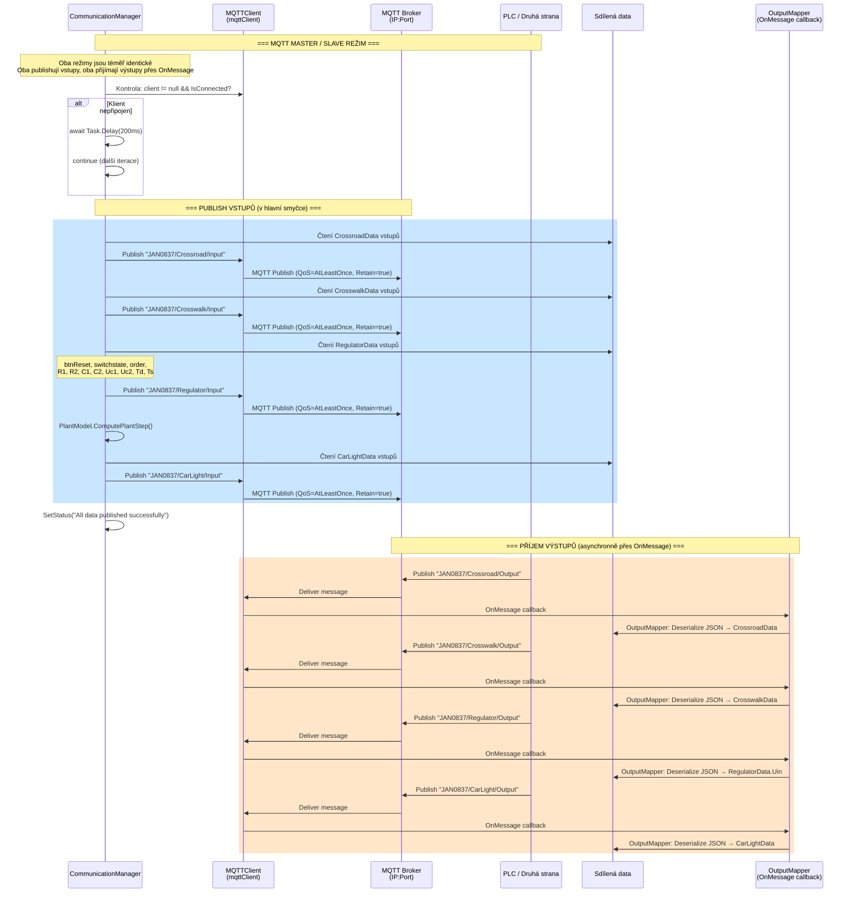

# MQTT – Sekvenční diagram komunikace

Detailní pohled na MQTT komunikaci v `CommunicationManager` – Master (publish) i Slave (publish) režim.

## MQTT Topics

| Topic | Směr | Obsah |
|-------|------|-------|
| `JAN0837/Crossroad/Input` | App → PLC | btnStart, btnPause, btnStop, btnWestCrosswalk1/2, btnSouthCrosswalk1/2 |
| `JAN0837/Crossroad/Output` | PLC → App | crossroadType, trafficLights (N/S/W/E × R/Y/G), pedestrians |
| `JAN0837/Crosswalk/Input` | App → PLC | start, pause, stop, cw1, cw2 |
| `JAN0837/Crosswalk/Output` | PLC → App | crosswalkType, trafficLight1/2, pedestrian1/2 |
| `JAN0837/Regulator/Input` | App → PLC | btnReset, switchstate, order, R1, R2, C1, C2, Uc1, Uc2, Td, Ts |
| `JAN0837/Regulator/Output` | PLC → App | Uin |
| `JAN0837/CarLight/Input` | App → PLC | btnReset, error, sensorLight, sensorConnectorConnected |
| `JAN0837/CarLight/Output` | PLC → App | lowBeamLight, highBeamLight, turnLight, result |

## Specifika MQTT

- **QoS**: AtLeastOnce (1) – zprávy jsou doručeny minimálně jednou
- **Retain**: true – broker uchovává poslední zprávu pro nové subscribery
- **Výstupy**: Přijímány **asynchronně** přes `OnMessage` callback v `MQTTClient`, ne v hlavní smyčce
- **OutputMapper**: Třída v `comMQTT.cs` která deserializuje JSON a mapuje na statické datové třídy
- **Serializace**: `System.Text.Json.JsonSerializer` pro publish, `Newtonsoft.Json` (JsonConvert) pro receive
- **Error handling**: `OperationCanceledException` se propaguje (throw), ostatní exceptions logují a pokračují s 500ms delay
