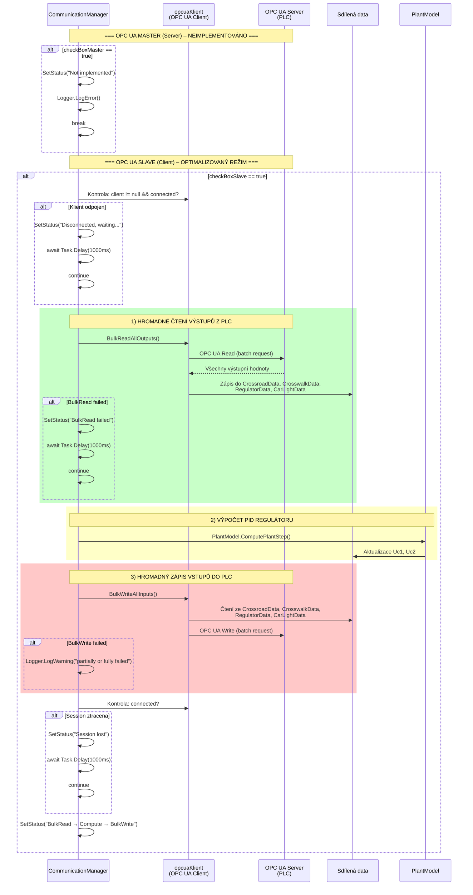
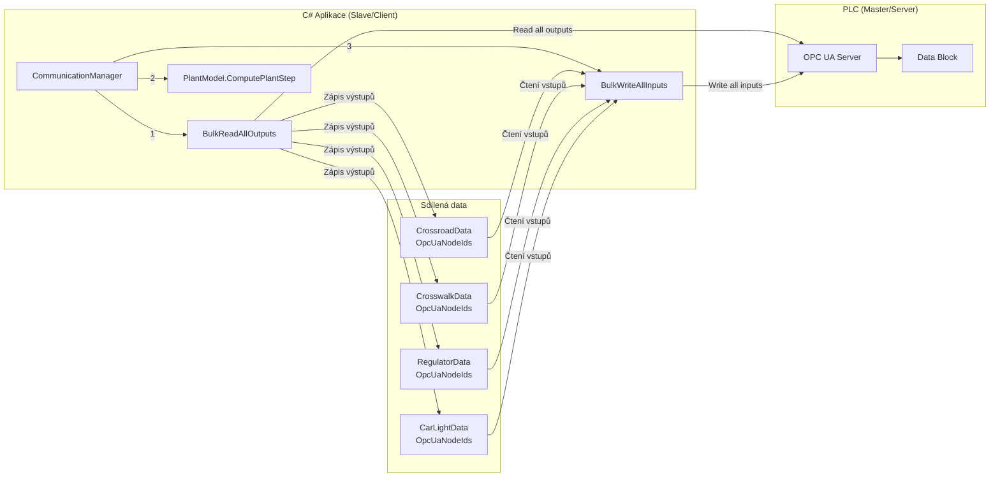

# OPC UA – Sekvenční diagram komunikace

Detailní pohled na OPC UA komunikaci – Master (Server, neimplementováno) a Slave (Client, BulkRead/BulkWrite).

## Architektura OPC UA komunikace

## Specifika OPC UA

- **Optimalizace**: ~50+ individuálních volání zredukováno na 2 (1× BulkRead + 1× BulkWrite)
- **Node ID mapování**: Každá datová třída obsahuje vnořenou třídu `OpcUaNodeIds` s konstantami node ID
- **Typy hodnot**: Bool (ReadOPCUABool), Float (ReadOPCUAFloat), Int (ReadOPCUAInt)
- **Session monitoring**: Kontrola `connected` po každé operaci, automatický reconnect
- **Reconnect delay**: 1000ms při ztrátě spojení (delší než u MQTT – 200ms)
- **Master režim**: Zakomentovaný v `#region OPCUA Server`, plánován ale neimplementován
- **Error handling**: Exception catch s 500ms delay, pak continue
