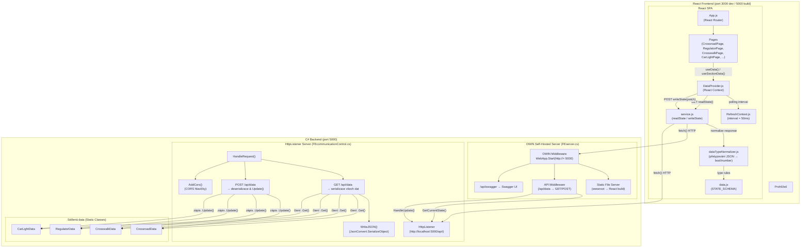
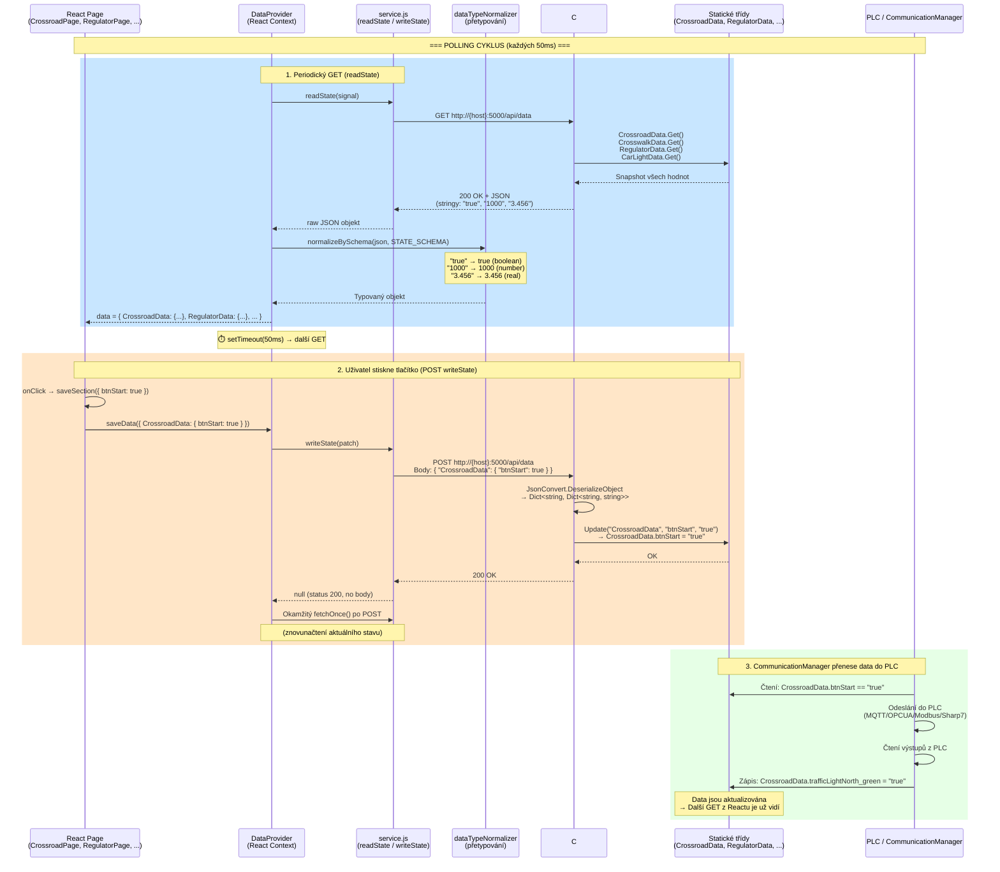
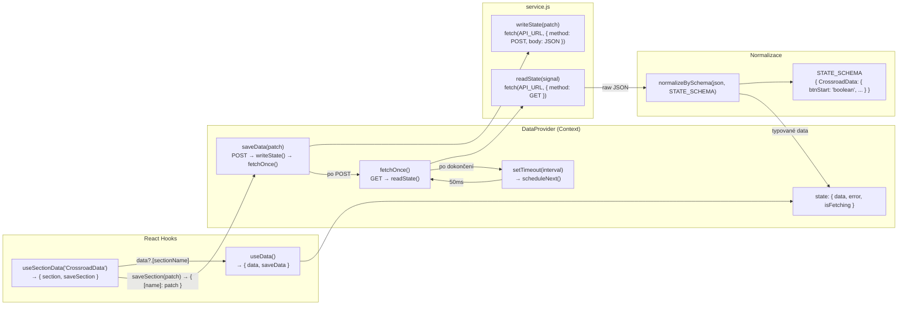
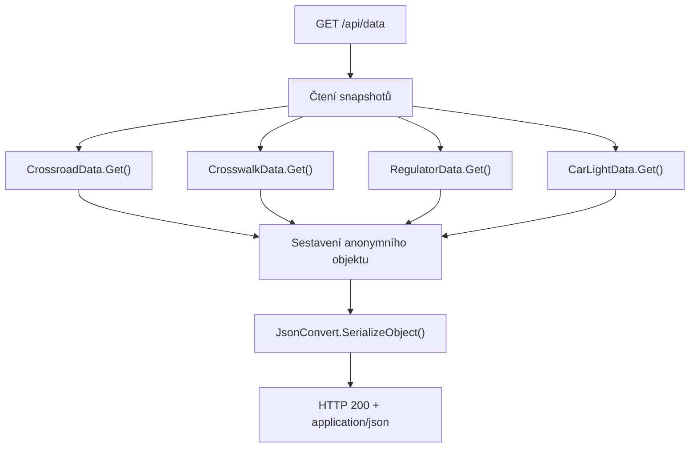
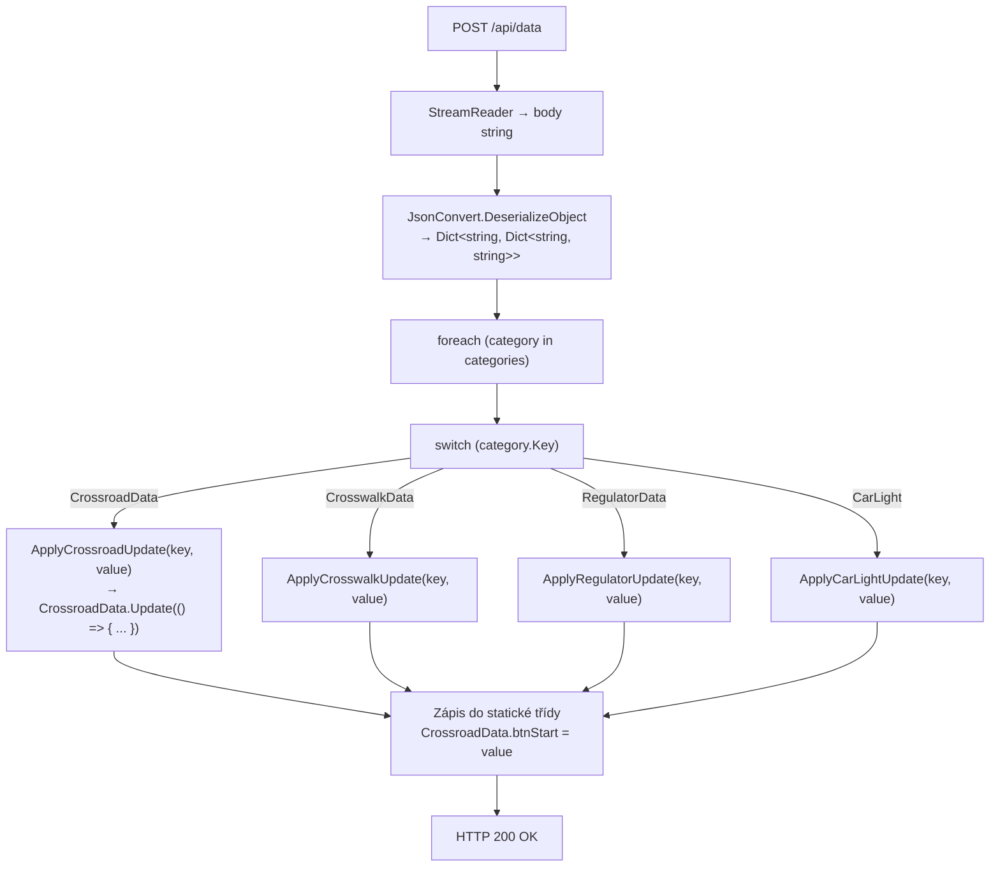
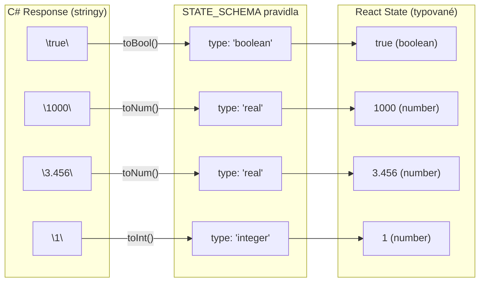
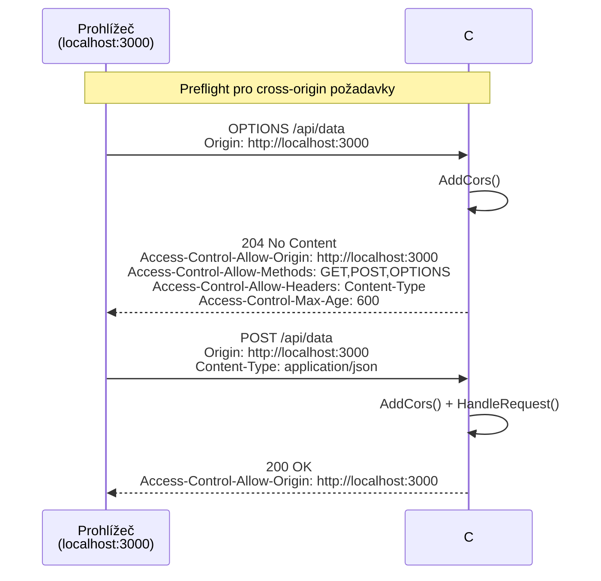
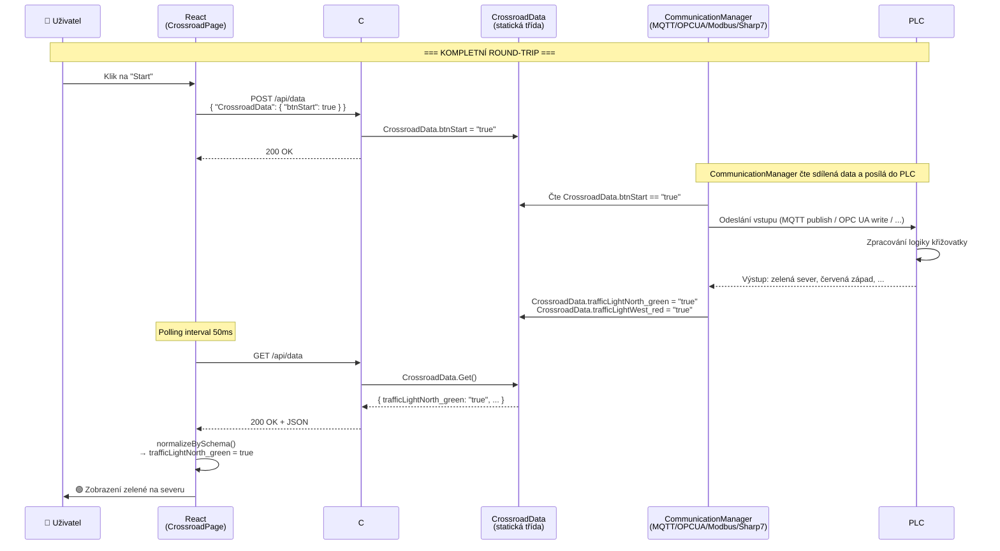

# REST API – Detailní dokumentace komunikace C# ↔ React

Kompletní popis REST API vrstvy – jak React frontend komunikuje s C# backendem (OWIN + HttpListener), včetně přesných formátů JSON dotazů a odpovědí.

---

## 1. Přehled architektury



---

## 2. Servery – dvě cesty ke stejným datům

Aplikace má **dva HTTP servery**, oba na portu 5000:

| Server | Soubor | Technologie | Prefix | Účel |
|--------|--------|-------------|--------|------|
| **OWIN** | `FEserver.cs` | `Microsoft.Owin.Hosting.WebApp` | `http://+:5000` | Servíruje React build + API middleware + Swagger |
| **HttpListener** | `FEcommunicationControl.cs` | `System.Net.HttpListener` | `http://localhost:5000/api/` | Čistý API server s CORS, fallback binding |

### OWIN Middleware pipeline (`FEserver.cs`):
```
Request → /api/swagger? → Swagger UI HTML
        → /api/data GET? → _feCommunication.GetCurrentState() → JSON response
        → /api/data POST? → _feCommunication.HandleUpdate() → 204 No Content
        → Static files (wwwroot: index.html, JS, CSS, images)
```

### HttpListener routing (`FEcommunicationControl.cs`):
```
Request → OPTIONS? → 204 (CORS preflight)
        → GET /swagger → Swagger HTML
        → GET /swagger/openapi.json → OpenAPI spec
        → GET /data nebo / → Všechna data jako JSON (inputs + outputs)
        → POST /data nebo / → Partial update z nested JSON → 200 OK
        → jiné → 405 Method Not Allowed
```

---

## 3. API Endpointy – detailní specifikace

### 3.1 `GET /api/data` – Čtení všech dat

**URL:** `http://{hostname}:5000/api/data`  
**Metoda:** `GET`  
**Content-Type odpovědi:** `application/json`  
**Status:** `200 OK`

#### Dva kontexty odpovědi:

| Kontext | Volání v kódu | Data | Použití |
|---------|--------------|------|---------|
| **OWIN** (`FEserver.cs`) | `GetCurrentState()` | Pouze **vstupy** (tlačítka, parametry) | Když OWIN middleware zpracuje `/api/data` |
| **HttpListener** (`HandleRequest`) | Celý blok v `HandleRequest()` | **Vstupy i výstupy** (kompletní stav) | Když HttpListener zpracuje request přímo |

#### GET Response – HttpListener (kompletní stav, vstupy + výstupy):

```json
{
  "CrossroadData": {
    "btnStart": "false",
    "btnPause": "false",
    "btnStop": "false",
    "crossroadType": "false",
    "btnWestCrosswalk1": "false",
    "btnWestCrosswalk2": "false",
    "btnSouthCrosswalk1": "false",
    "btnSouthCrosswalk2": "false",
    "trafficLightNorth_green": "false",
    "trafficLightNorth_yellow": "false",
    "trafficLightNorth_red": "true",
    "trafficLightSouth_green": "false",
    "trafficLightSouth_yellow": "false",
    "trafficLightSouth_red": "true",
    "trafficLightWest_green": "true",
    "trafficLightWest_yellow": "false",
    "trafficLightWest_red": "false",
    "trafficLightEast_green": "true",
    "trafficLightEast_yellow": "false",
    "trafficLightEast_red": "false",
    "pedestrianSouth1_green": "false",
    "pedestrianSouth1_red": "true",
    "pedestrianSouth2_green": "false",
    "pedestrianSouth2_red": "true",
    "pedestrianWest1_green": "true",
    "pedestrianWest1_red": "false",
    "pedestrianWest2_green": "true",
    "pedestrianWest2_red": "false"
  },
  "CrosswalkData": {
    "btnStart": "false",
    "btnPause": "false",
    "btnStop": "false",
    "crosswalkType": "false",
    "btnCrosswalk1": "false",
    "btnCrosswalk2": "false",
    "trafficLight1_green": "false",
    "trafficLight1_yellow": "false",
    "trafficLight1_red": "true",
    "trafficLight2_green": "true",
    "trafficLight2_yellow": "false",
    "trafficLight2_red": "false",
    "pedestrian1_green": "true",
    "pedestrian1_red": "false",
    "pedestrian2_green": "false",
    "pedestrian2_red": "true"
  },
  "RegulatorData": {
    "btnReset": "false",
    "switchstate": "true",
    "order": "1",
    "R1": "1000",
    "R2": "0",
    "C1": "0.001",
    "C2": "0",
    "Uc1": "3.456",
    "Uc2": "0",
    "Td": "0.05",
    "Ts": "0.01",
    "Uin": "5.0"
  },
  "CarLight": {
    "btnReset": "false",
    "error": "false",
    "sensorLight": "true",
    "sensorConnectorConnected": "true",
    "lowBeamLight": "true",
    "highBeamLight": "false",
    "turnLight": "false",
    "result": "false"
  }
}
```

> **Poznámka:** Všechny hodnoty jsou **stringy** (`"true"`, `"false"`, `"1000"`, `"3.456"`). React strana je normalizuje na nativní typy přes `dataTypeNormalizer.js`.

#### GET Response – OWIN `GetCurrentState()` (pouze vstupy):

```json
{
  "CrossroadData": {
    "btnStart": "false",
    "btnPause": "false",
    "btnStop": "false",
    "btnWestCrosswalk1": "false",
    "btnWestCrosswalk2": "false",
    "btnSouthCrosswalk1": "false",
    "btnSouthCrosswalk2": "false"
  },
  "CrosswalkData": {
    "btnStart": "false",
    "btnPause": "false",
    "btnStop": "false",
    "btnCrosswalk1_crosswalk": "false",
    "btnCrosswalk2_crosswalk": "false"
  },
  "RegulatorData": {
    "btnReset": "false",
    "switchstate": "false",
    "order": "1",
    "R1": "1000",
    "R2": "0",
    "C1": "0.001",
    "C2": "0",
    "Uc1": "0",
    "Uc2": "0",
    "Td": "0",
    "Ts": "0"
  },
  "CarLight": {
    "btnReset": "false",
    "error": "false",
    "sensorLight": "false",
    "sensorConnectorConnected": "false"
  }
}
```

---

### 3.2 `POST /api/data` – Zápis dat (partial update)

**URL:** `http://{hostname}:5000/api/data`  
**Metoda:** `POST`  
**Content-Type požadavku:** `application/json`  
**Status:** `200 OK` (HttpListener) / `204 No Content` (OWIN)

#### Formát POST body – vnořený JSON (nested):

```json
{
  "CategoryName": {
    "key1": "value1",
    "key2": "value2"
  }
}
```

- **Partial update**: posílá se POUZE to, co se mění
- Kategorie: `"CrossroadData"`, `"CrosswalkData"`, `"RegulatorData"`, `"CarLight"`
- Klíče odpovídají názvům vlastností v C# statických třídách

#### Příklady POST požadavků:

**Stisknutí tlačítka Start na křižovatce:**
```json
{
  "CrossroadData": {
    "btnStart": true
  }
}
```

**Změna parametrů regulátoru (odpor + kapacita):**
```json
{
  "RegulatorData": {
    "R1": 1500,
    "C1": 0.002
  }
}
```

**Přepnutí řádu regulátoru na 2. řád:**
```json
{
  "RegulatorData": {
    "order": 2
  }
}
```

**Reset senzoru CarLight:**
```json
{
  "CarLight": {
    "btnReset": true
  }
}
```

**Kombinovaný update více kategorií najednou:**
```json
{
  "CrossroadData": {
    "btnStop": true
  },
  "RegulatorData": {
    "switchstate": false,
    "R1": 2200
  },
  "CarLight": {
    "error": false
  }
}
```

---

### 3.3 Další endpointy

| Metoda | URL | Status | Popis |
|--------|-----|--------|-------|
| `OPTIONS` | `/api/*` | `204` | CORS preflight (vrací Allow-Origin, Allow-Methods, Allow-Headers) |
| `GET` | `/api/swagger` | `200` | Swagger UI HTML stránka |
| `GET` | `/api/swagger/openapi.json` | `200` | OpenAPI 3.0 specifikace (JSON) |
| `GET` | `/*` | `200` | SPA fallback → `wwwroot/index.html` |
| `GET` | `/static/*` | `200` | Statické soubory React buildu |

---

## 4. Sekvenční diagram – polling cyklus



---

## 5. React strana – architektura komunikace

### 5.1 Klíčové soubory

| Soubor | Účel |
|--------|------|
| `variables.js` | `API_URL = http://${window.location.hostname}:5000/api/data` |
| `service.js` | `readState()` → GET, `writeState(patch)` → POST |
| `RefreshContext.js` | React Context pro interval pollingu (default **50ms**) |
| `DataProvider.js` | Centrální React Context – periodicky volá `readState()`, poskytuje `useData()` hook |
| `data.js` | `STATE_SCHEMA` – definice datových typů pro normalizaci |
| `dataTypeNormalizer.js` | `normalizeBySchema()` – konvertuje string odpovědi na nativní JS typy |

### 5.2 Tok dat v Reactu



### 5.3 useSectionData hook – jak stránky pracují s daty

```javascript
// Příklad: CrossroadPage.js
const { section: d, saveSection } = useSectionData('CrossroadData');

// Čtení výstupů z PLC (přijaté přes GET polling):
const greenNorth = toBool(d?.trafficLightNorth_green);  // true/false

// Zápis vstupu do PLC (odesláno přes POST):
await saveSection({ btnStart: !toBool(d?.btnStart) });
// → POST { "CrossroadData": { "btnStart": true } }
```

```javascript
// Příklad: RegulatorPage.js
const { section: d, saveSection } = useSectionData('RegulatorData');

// Čtení výstupní hodnoty:
const Uc1 = Number(d?.Uc1 ?? 0);  // napětí na kondenzátoru

// Zápis parametrů:
await saveSection({ R1: 1500 });         // odpor
await saveSection({ order: 2 });          // přepnutí na 2. řád
await saveSection({ switchstate: true }); // zapnutí spínače
// → POST { "RegulatorData": { "R1": 1500 } }
```

---

## 6. C# strana – zpracování požadavků

### 6.1 GET – serializace dat



**C# kód (HttpListener – HandleRequest):**
```csharp
// GET /api/data → kompletní stav (vstupy + výstupy)
var crossroaddata = CrossroadData.Get();
var crosswalkdata = CrosswalkData.Get();
var regulatordata = RegulatorData.Get();
var carlightdata  = CarLightData.Get();

WriteJSON(resp, new {
    CrossroadData = new {
        btnStart = crossroaddata.btnStart,           // vstup
        trafficLightNorth_green = crossroaddata.trafficLightNorth_green, // výstup
        // ... všechny vlastnosti
    },
    CrosswalkData = new { /* ... */ },
    RegulatorData = new {
        btnReset = regulatordata.btnReset,   // vstup
        R1 = regulatordata.R1,               // vstup (parametr)
        Uc1 = regulatordata.Uc1,             // výstup (vypočteno PlantModelem)
        Uin = regulatordata.Uin,             // výstup z PLC
        // ...
    },
    CarLight = new { /* ... */ }
});
```

### 6.2 POST – deserializace a update



**C# kód (HttpListener – HandleRequest):**
```csharp
// POST /api/data
var body = sr.ReadToEnd();
// body = { "CrossroadData": { "btnStart": "true" }, "RegulatorData": { "R1": "1500" } }

var categories = JsonConvert.DeserializeObject<Dictionary<string, Dictionary<string, string>>>(body);

foreach (var category in categories)
{
    foreach (var kv in category.Value)
    {
        Update(category.Key, kv.Key, kv.Value ?? "");
        // → switch("CrossroadData") → ApplyCrossroadUpdate("btnStart", "true")
        // → CrossroadData.Update(() => { CrossroadData.btnStart = "true"; })
    }
}

resp.StatusCode = 200;
```

---

## 7. Mapování dat – kategorie a klíče

### CrossroadData

| Klíč JSON | C# property | Směr | Typ | Popis |
|-----------|------------|------|-----|-------|
| `btnStart` | `CrossroadData.btnStart` | FE → PLC | bool (string) | Spuštění křižovatky |
| `btnPause` | `CrossroadData.btnPause` | FE → PLC | bool | Pauza |
| `btnStop` | `CrossroadData.btnStop` | FE → PLC | bool | Zastavení |
| `btnWestCrosswalk1` | `CrossroadData.btnWestCrosswalk1` | FE → PLC | bool | Tlačítko chodce Západ 1 |
| `btnWestCrosswalk2` | `CrossroadData.btnWestCrosswalk2` | FE → PLC | bool | Tlačítko chodce Západ 2 |
| `btnSouthCrosswalk1` | `CrossroadData.btnSouthCrosswalk1` | FE → PLC | bool | Tlačítko chodce Jih 1 |
| `btnSouthCrosswalk2` | `CrossroadData.btnSouthCrosswalk2` | FE → PLC | bool | Tlačítko chodce Jih 2 |
| `crossroadType` | `CrossroadData.crossroadType` | PLC → FE | bool | Typ (den/noc) |
| `trafficLightNorth_green` | `CrossroadData.trafficLightNorth_green` | PLC → FE | bool | Sever – zelená |
| `trafficLightNorth_yellow` | `CrossroadData.trafficLightNorth_yellow` | PLC → FE | bool | Sever – žlutá |
| `trafficLightNorth_red` | `CrossroadData.trafficLightNorth_red` | PLC → FE | bool | Sever – červená |
| `trafficLightSouth_green/yellow/red` | `CrossroadData.trafficLightSouth_*` | PLC → FE | bool | Jih |
| `trafficLightWest_green/yellow/red` | `CrossroadData.trafficLightWest_*` | PLC → FE | bool | Západ |
| `trafficLightEast_green/yellow/red` | `CrossroadData.trafficLightEast_*` | PLC → FE | bool | Východ |
| `pedestrianSouth1_green/red` | `CrossroadData.pedestrianSouth1_*` | PLC → FE | bool | Chodec Jih 1 |
| `pedestrianSouth2_green/red` | `CrossroadData.pedestrianSouth2_*` | PLC → FE | bool | Chodec Jih 2 |
| `pedestrianWest1_green/red` | `CrossroadData.pedestrianWest1_*` | PLC → FE | bool | Chodec Západ 1 |
| `pedestrianWest2_green/red` | `CrossroadData.pedestrianWest2_*` | PLC → FE | bool | Chodec Západ 2 |

### CrosswalkData

| Klíč JSON | Směr | Typ | Popis |
|-----------|------|-----|-------|
| `btnStart`, `btnPause`, `btnStop` | FE → PLC | bool | Řízení přechodu |
| `btnCrosswalk1`, `btnCrosswalk2` | FE → PLC | bool | Tlačítka chodců |
| `crosswalkType` | PLC → FE | bool | Typ (den/noc) |
| `trafficLight1_green/yellow/red` | PLC → FE | bool | Semafor 1 |
| `trafficLight2_green/yellow/red` | PLC → FE | bool | Semafor 2 |
| `pedestrian1_green/red` | PLC → FE | bool | Chodec 1 |
| `pedestrian2_green/red` | PLC → FE | bool | Chodec 2 |

### RegulatorData

| Klíč JSON | Směr | Typ | Popis |
|-----------|------|-----|-------|
| `btnReset` | FE → PLC | bool | Reset regulátoru |
| `switchstate` | FE → PLC | bool | Spínač ON/OFF |
| `order` | FE → PLC | integer | Řád (1 = RC, 2 = RC-RC) |
| `R1`, `R2` | FE → PLC | real | Odpory (Ω) |
| `C1`, `C2` | FE → PLC | real | Kapacity (F) |
| `Td` | FE → PLC | real | Dopravní zpoždění |
| `Ts` | FE → PLC | real | Vzorkovací perioda |
| `Uc1`, `Uc2` | PLC → FE | real | Napětí na kondenzátorech (V) – vypočteno PlantModelem |
| `Uin` | PLC → FE | real | Vstupní napětí z PLC (V) |

### CarLight

| Klíč JSON | Směr | Typ | Popis |
|-----------|------|-----|-------|
| `btnReset` | FE → PLC | bool | Reset |
| `error` | FE → PLC | bool | Chybový stav |
| `sensorLight` | FE → PLC | bool | Senzor osvětlení |
| `sensorConnectorConnected` | FE → PLC | bool | Senzor konektoru |
| `lowBeamLight` | PLC → FE | bool | Potkávací světla |
| `highBeamLight` | PLC → FE | bool | Dálková světla |
| `turnLight` | PLC → FE | bool | Blinkry |
| `result` | PLC → FE | bool | Výsledek diagnostiky |

---

## 8. Normalizace dat (React strana)

React přijímá z C# API **vše jako stringy**. `dataTypeNormalizer.js` přetypuje na nativní JS typy podle `STATE_SCHEMA`:



**Konverzní funkce:**
| Typ v SCHEMA | JS funkce | Příklady |
|-------------|-----------|----------|
| `boolean` | `toBool()` | `"true"` → `true`, `"1"` → `true`, `"false"` → `false` |
| `real` / `number` | `toNum()` | `"3.456"` → `3.456`, `"1000"` → `1000` |
| `integer` / `int` | `toInt()` | `"2"` → `2`, `"1.5"` → `1` |
| `string` | `toStr()` | beze změny |

---

## 9. CORS handling



**Logika v `AddCors()`:**
- Pokud je `Origin` hlavička přítomna → echo zpět jako `Allow-Origin`
- Fallback → `internalVariables.feURL`
- Hlavička `Vary: Origin` pro korektní cache

---

## 10. Životní cyklus dat – kompletní round-trip



---

## 11. Specifika a poznámky

| Vlastnost | Detail |
|-----------|--------|
| **Polling interval** | 50ms (nastavitelný uživatelem v React UI přes `RefreshContext`) |
| **Serializace C#** | `Newtonsoft.Json.JsonConvert` (`FEcommunicationControl`, `FEserver`) |
| **API URL v Reactu** | `http://${window.location.hostname}:5000/api/data` (dynamická detekce IP) |
| **AbortController** | React ruší předchozí GET při novém cyklu (`abortRef.current?.abort()`) |
| **POST → GET** | Po každém POST se okamžitě provede `fetchOnce()` (znovunačtení) |
| **Thread safety** | Statické třídy používají `Update(() => { ... })` pattern pro bezpečný zápis |
| **CommunicationManager** | V režimu `"RESTAPI"` je **pasivní** – pouze zobrazí status, žádná aktivní komunikace |
| **Swagger** | Dostupný na `http://{host}:5000/api/swagger` – interaktivní dokumentace |
| **Prefix binding** | HttpListener zkouší 4 prefixové varianty: `http://+`, `http://*`, `http://LocalIP`, `http://localhost` |
- **Prefix binding**: `FEcommunicationControl` používá `HttpListener` s dynamickým prefix bindingem
