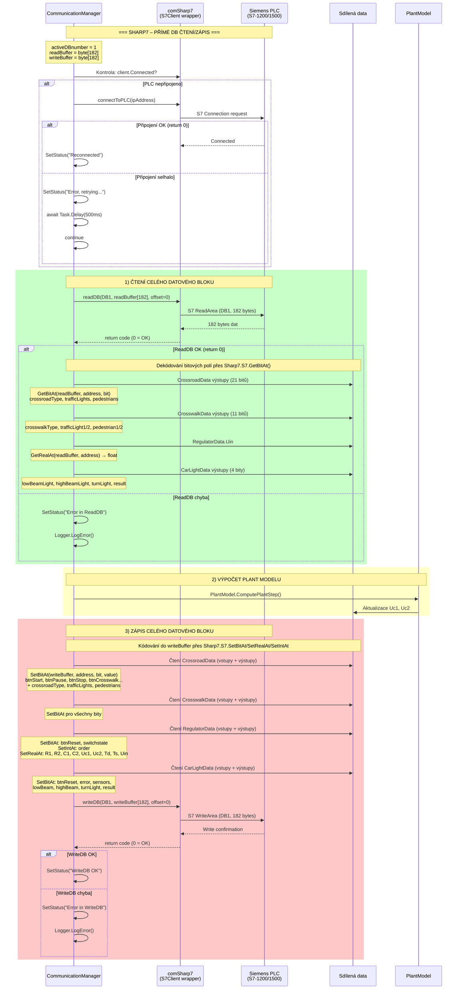
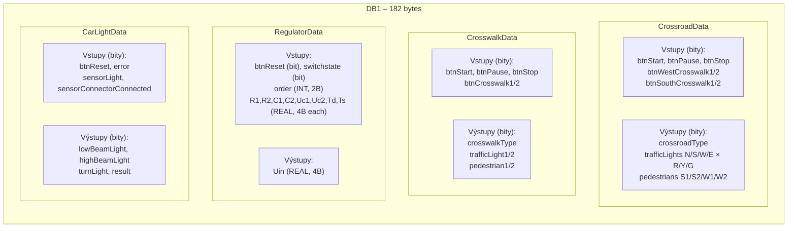

# Sharp7 – Sekvenční diagram komunikace

Detailní pohled na Sharp7 (S7 Protocol) komunikaci – přímé čtení/zápis datového bloku PLC.



## Struktura datového bloku (DB1, 182 bytes)



## Adresování v Sharp7

Každá datová třída obsahuje vnořenou třídu `Sharp7Addresses` s konstantami:

```
Sharp7.S7.GetBitAt(buffer, address_byte, bit_position)  → bool
Sharp7.S7.SetBitAt(buffer, address_byte, bit_position, value)
Sharp7.S7.GetRealAt(buffer, address_byte)                → float (4 bytes)
Sharp7.S7.SetRealAt(buffer, address_byte, value)
Sharp7.S7.SetIntAt(buffer, address_byte, value)          → short (2 bytes)
```

## Specifika Sharp7

- **Přímý přístup**: Čtení/zápis celého datového bloku najednou (182 bytes)
- **Bez Master/Slave**: Žádný přepínač – vždy klientský režim
- **Bitová úroveň**: Přístup k jednotlivým bitům přes `GetBitAt`/`SetBitAt`
- **Float (REAL)**: 4 bytes v Big-Endian formátu (S7 konvence)
- **INT**: 2 bytes signed integer
- **Obousměrný zápis**: WriteDB zapisuje **vstupy i výstupy** zpět do PLC
- **Reconnect**: Automatický pokus o reconnect s `connectToPLC(ip)` při ztrátě spojení
- **DB číslo**: Pevně nastaveno na DB1 (`activeDBnumber = 1`)
- **PPI**: Typ připojení používá `S7Client.ConnectionType.PPI`
